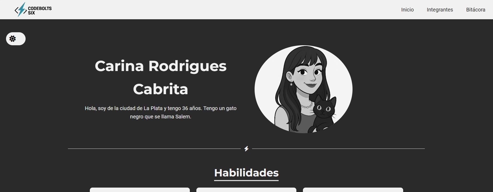
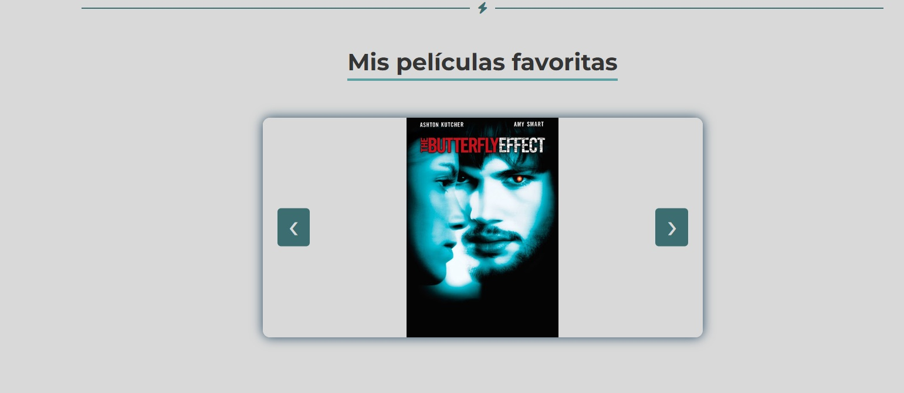
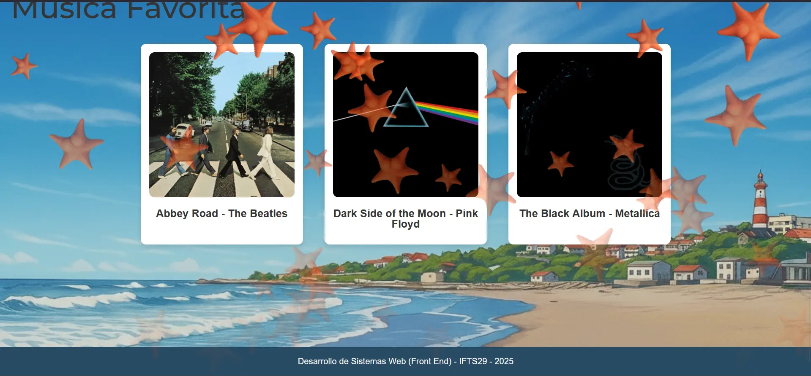

# Tecnicatura Superior en Desarrollo de Software - IFTS29
## Trabajo Práctico Grupal 1<br>Proyecto Web en Equipo<br>

**Materia:** Desarrollo de Sistemas Web (Front End)  
**Profesor:** LUCIANO ARIEL MARTINEZ  
**Comisión:** A  


## **Grupo 6 (Codebolts Six):**  

| Nombre              | Página individual     |
|---------------------|-----------------------|
| Rodrigues, Carina   | [crc.html](juan.html) |
| Mendiola, Eduardo E.| [eduardo.html](maria.html) |
| Herrera, Neuyin     | [neuyin.html](neuyin.html) |
| Integrante 4        | [integrante4.html](int4.html) |
| Integrante 5        | [integrante5.html](int5.html) |


**Fecha:** 19-09-2025  

---

## Enlace al Proyecto Desplegado
- Repositorio GitHub: [https://github.com/CariRodrigues/Frontend2025](https://github.com/CariRodrigues/Frontend2025)
- Proyecto en Vercel: [https://frontend2025-five.vercel.app/index.html](https://frontend2025-five.vercel.app/index.html)

## Descripción del Proyecto
Este trabajo práctico consiste en desarrollar un sitio web que sirva como presentación del equipo de trabajo “Codebolts Six”.  
El objetivo del proyecto es crear un portfolio web individual y colectivo, donde cada integrante presenta su perfil profesional y personal de manera organizada. Cada miembro tuvo libertad para diseñar su propia tarjeta de presentación, eligiendo la información y la forma de mostrarla, incluyendo habilidades, intereses y otros datos relevantes.


El proyecto incluye:
- **Portada (index.html):** Presentación del equipo y listado de integrantes con enlaces a sus páginas individuales.
- **Páginas individuales:** Cada integrante tiene su página de presentación con foto, habilidades, películas y música favorita.
- **Sección de bitácora (bitacora.html):** Documentación del proceso de desarrollo, decisiones de diseño y dificultades resueltas.
- **Diseño responsive:** Adaptable a móviles, tablets y escritorio (breakpoints: 400px, 900px, 1200px).
- **Interacciones dinámicas:** JavaScript aplicado para mejorar la experiencia del usuario.

## Tecnologías Utilizadas
- HTML5
- CSS3 (tipografías de Google Fonts)
- JavaScript (Vanilla JS)
- Git y GitHub
- ChatGPT utilizado como soporte en el desarrollo.
- Imágenes y avatares generados con IA o ilustraciones

## Estructura de Archivos
```

/ (directorio raíz)
├── index.html             # Portada del proyecto
├── bitacora.html          # Sección de bitácora
├── crc.html               # Página individual de Carina Rodrigues
├── eduardo.jpg            # Página individual de Eduardo Mendiola
├── neuyin.html            # Página individual de Neuyin Herrera
├── int4.html              # Página individual del integrante 4
├── int5.html              # Página individual del integrante 5
├── css/
│   ├── styles.css         # Hoja de estilos principal
|   ├── _reset_edu.css     # Reset css
│   ├── bitacora.css       
│   ├── style_carina.css    
│   ├── style_eduardo.css       
│   ├── style_neuyin.css      
│   ├── style_int4.css 
│   └── style_int5.css   
├── js/
│   ├── crc.js             # JS individual de Carina Rodrigues
│   ├── eduardo.js         # JS individual de Eduardo Mendiola
│   ├── neuyin.js          # JS individual de Neuyin Herrera
│   ├── int4.js            # JS individual del integrante 4
│   ├── int5.js            # JS individual del integrante 5
│   └── main.js            # Funciones dinámicas generales
├── img/  
│   ├── car
│   ├── eduardo
|   ├── neuyin
│   ├── logo
│   └── portada
├── assests               # Documentos para el readme
|     ├── capturas-carina    
│     ├── capturas-eduardo   
│     ├── capturas-neuyin       
│     ├── capturas-int4       
│     └── capturas-int5     
└── README.md               # Este archivo

```

## Contenido en Páginas Individuales
Cada integrante tiene un porfolio con:
- **Foto**
- **Nombre completo**
- **Ubicación actual**: Ciudad
- **Edad**
- **Habilidades**: (mínimo 4)
- **Películas favoritas**: (mínimo 3)
- **Música favorita / discos**: (mínimo 3)
- Botones de navegación para volver a la portada o moverse entre integrantes.

---

## Capturas de Pantalla de los porfolios

---

### **Carina Rodrigues**
**Underline**
Se implementó un subrayado animado bajo los títulos h2, que mejora la interacción visual de la página.
**Tipo de animación:** la línea del subrayado aparece de izquierda a derecha, simulando que se "dibuja" mientras el usuario llega a la sección
**Animación controlada con CSS:** se utiliza transform: scaleX(0) al inicio y transform: scaleX(1) al final, para lograr el efecto.
La transición (transition: transform 0.6s ease-out) suaviza el movimiento.
**Interacción con scroll:** Mediante IntersectionObserver, la animación puede activarse cada vez que el usuario llega a la sección donde se encuentra el título.


**Modo oscuro**

Se implementó un modo oscuro que permite alternar entre tema claro y oscuro, cambiando los colores principales de la interfaz y reemplazando imágenes generales para mantener la coherencia visual según el tema seleccionado.

#### Carrusel de imagenes



---
### **Eduardo Mendiola**
### Header

#### Efecto spin
Se aplic una animación a un ícono de sol (.sun_icon) que gira continuamente en el centro de la palabra Mar del Plata. Utiliza la regla @keyframes spin para rotar el elemento de 0° a 360° de forma infinita, con una duración de 10 segundos y un movimiento lineal. Además, el sol está centrado con position: absolute y transform: translate(-50%, -50%).


### Habilidades

#### Efecto traslación
Se implemento un efecto de movimiento para una imagen de un lobo de mar (.sea-wolf) que se desplaza horizontalmente al hacer scroll. A continuación, una breve descripción:

- **Movimiento horizontal sincronizado con el scroll:**
Cada imagen del lobo se mueve de un lado al otro de la pantalla dependiendo de la posición del scroll. La dirección del movimiento alterna entre las secciones.

- **Progreso del scroll:**
Se calcula el progreso del scroll dentro de cada sección para determinar la posición exacta del lobo.

- **Efecto de "latido":**
Mientras el lobo se mueve, se aplica una animación de escala que simula un pequeño "latido".

- **Cambio de imágenes:**
Dependiendo de la dirección del scroll, se alternan las imágenes del lobo y su reflejo (lobo_mar.png y lobo_mar2.png).


- **Mostrar cartel oculto:**
el efecto permite mostrar un mensaje (.wolf-message) cuando el usuario pasa el cursor sobre el contenedor del lobo de mar (.sea-wolf-wrap). La propiedad opacity cambia de 0 a 1 al hacer hover, creando una transición suave y haciendo visible el mensaje.


- **Interacción al hacer clic:**
Al hacer clic en el lobo, aparece una imagen de un grupo de lobos (.wolf-pack) que se muestra durante 4 segundos.


- **Desplazamiento vertical y sombra:**
Este efecto estiliza las tarjetas (.card) con un diseño limpio y moderno. Al pasar el cursor sobre una tarjeta, se aplica una animación que la eleva ligeramente (translateY(-10px)) y aumenta la sombra (box-shadow), creando un efecto de "flotación" que resalta la interacción del usuario.


### Peliculas Favoritas

#### Efecto parallax:
Se aplico un efecto de parallax interactivo a las tarjetas con la clase .parallax-card. Cuando el usuario mueve el cursor sobre una tarjeta, esta rota dinámicamente en los ejes X e Y en función de la posición del mouse, creando un efecto 3D. Al salir el cursor de la tarjeta, esta vuelve a su posición original con una rotación de 0deg.


### Musica Favorita

#### Efecto parallax:


#### LLuvias de estrellas

Este código crea un efecto visual en el que estrellas animadas aparecen cuando el usuario llega al footer de la página:

- **createStarsBatch:** Genera un lote de estrellas con un intervalo entre cada una, utilizando la función setTimeout para escalonar su creación.

- **Detección del footer en pantalla:**
Se utiliza un evento scroll para verificar si el footer entra en la vista del usuario (footerTop <= window.innerHeight). Cuando esto ocurre, se activa la animación de las estrellas.

- **Animación continua mientras el footer está visible:**
Mientras el footer permanece en pantalla, se crean lotes de estrellas cada segundo (setInterval). Si el footer deja de estar visible, el intervalo se detiene.



### Modo oscuro

Se implementó un modo oscuro que permite alternar entre tema claro y oscuro, cambiando los colores principales de la interfaz y reemplazando imágenes generales para mantener la coherencia visual según el tema seleccionado.


---

### **Neuyin Herrera**


---

### **Int 3**


---

### **Int 3**


---


## Funciones JavaScript Implementadas
### Portada (index.html)
- **Mensaje de bienvenida**: Al hacer clic en el botón “Conocer al equipo”, aparece un modal con un mensaje de bienvenida.  
- **Hover sobre integrantes**: Al pasar el mouse sobre cada nombre de integrante, se aplica una animación de subrayado y cambio de color.

### Páginas individuales (eduardo.html)
- **Desplegar información extra**: Botón “Mostrar más” despliega o oculta datos adicionales del integrante.
- **Cambio de colores**: Botón “Cambiar tema” alterna entre dos esquemas de colores en la tarjeta.
- **Alertas de interés**: Al hacer clic en una película o disco, se muestra una alerta con un comentario adicional.

### Bitácora (bitacora.html)
- Listado cronológico de decisiones de diseño, dificultades y cómo se resolvieron.

```

05/09/25: Se definió el esquema de colores y tipografía.
07/09/25: Implementadas animaciones en la portada.
12/09/25: Ajustes de responsive en tablet (900px) y móvil (400px).
18/09/25: Creación de páginas individuales de cada integrante.

```

## Diseño Responsive
- Breakpoints implementados en CSS:
- 400px: móviles pequeños
- 900px: tablets y pantallas medianas
- 1200px: pantallas de escritorio grandes
- Todos los elementos se adaptan correctamente evitando desbordes o superposiciones.

---

> Nota: Este README debe actualizarse en TP2 y TP3 incorporando mejoras, capturas de pantalla y cambios realizados, reflejando la evolución del proyecto.
